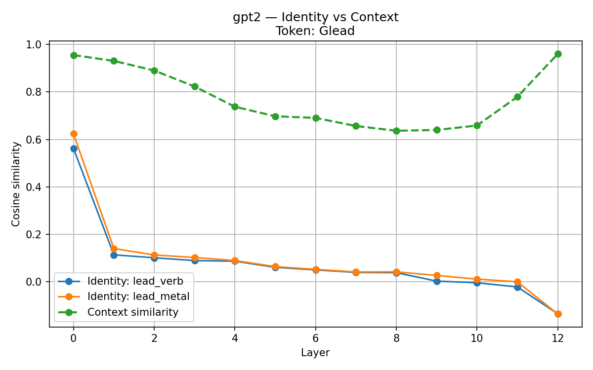

# Token Identity Drift

**How lexical token embeddings rapidly lose identity and become context-dominated inside transformer models.**

This repository presents a reproducible interpretability study of how individual token representations evolve inside transformer language models.

It shows that **token embeddings act only as an initialization**: after a small number of layers, representations are dominated by contextual interaction rather than lexical origin.

---

## Motivation

Transformer models begin computation from discrete token embeddings yet their downstream behavior suggests that these embeddings do **not** function as stable semantic units. Meaning appears to emerge through contextual interaction across layers rather than being preserved as a fixed symbolic unit.

This project investigates two concrete questions:

1. **How rapidly does a token’s representation drift away from its original embedding?**
2. **How do identical tokens in different semantic contexts diverge and reconverge across layers?**

These questions are relevant to:
- Mechanistic interpretability
- Polysemy and disambiguation
- Tokenization design
- Long-context degradation
- Representation alignment

---

## Method Overview

- **Models:** GPT-2, DistilGPT-2, GPT-2-Medium
- **Target tokens:** Polysemous whole-word tokens (e.g. `Ġlead`, `Ġbank`)
- **Metric:** Cosine similarity
- **Identity similarity** measures alignment between a token’s hidden state and its original embedding.
- **Context similarity** measures alignment between hidden states of the same token appearing in different semantic contexts.

For each experiment:
1. A prompt is tokenized
2. The hidden state corresponding to the *same token ID* is extracted at every layer
3. Cosine similarity is computed between:
   - the token’s original embedding, and
   - its hidden-state vector at each layer (**identity similarity**)
4. For matched pairs, cosine similarity is computed between:
   - the hidden states of the same token in two different contexts (**context similarity**)

All results are saved as CSVs and plotted automatically.

---

## Experiments

Experiments are defined as paired semantic contrasts using the **same surface token** across distinct contexts.

```yaml
experiments:
  - label: lead_verb
    token: "Ġlead"
    prompt: "She will lead the team through the transition."

  - label: lead_metal
    token: "Ġlead"
    prompt: "The pipes were contaminated with lead."

  - label: bank_finance
    token: "Ġbank"
    prompt: "The bank approved the loan."

  - label: bank_river
    token: "Ġbank"
    prompt: "The boat reached the river bank."
```

---

## Outputs per Experiment

Each experiment produces:

* A **per-layer identity similarity CSV**
  (cosine similarity between the token’s original embedding and its hidden state at each layer)

* A **context similarity CSV**
  (cosine similarity between hidden states of the *same token* in two different semantic contexts)

* A **composite plot** showing:

  * Identity drift for **each sense** of the token
  * Context similarity between those senses across layers

---

## Results

### Identity vs Context Drift

*Example: `Ġlead` (verb vs metal), GPT-2-Medium*

#### Key Takeaways

**Identity collapses almost immediately**
- Cosine similarity to the original embedding drops sharply after the first transformer layer, approaching zero or becoming negative.

**Semantic disambiguation occurs after identity loss**
- The verb and metal senses of `Ġlead` diverge *after* lexical identity has already vanished, indicating that disambiguation does not rely on preserved token identity.

**Contextual representations reconverge in late layers**
- In deeper layers, representations of distinct meanings become more similar again, suggesting abstraction toward task-level or predictive features rather than stable semantic storage.

**Negative identity similarity is common**
- Token representations often become *anti-aligned* with their original embeddings, indicating a complete basis change rather than gradual decay or noise.

---

### Identity vs Context Drift — `Ġlead` (GPT-2)



--- 

## Interpreting Token Identity 

The embedding table provides only an **initial condition**.

After just a few transformer layers:

* Token embeddings no longer anchor meaning
* Representations are dominated by contextual interaction
* “Token identity” has a measurable, short half-life

This supports the view that:

> **Transformers do not represent words — they represent trajectories shaped by context.**

Meaning is used transiently for prediction, not preserved as a stable internal symbol.

---

## Interpreting Context Similarity

In the composite plots, the **context similarity** curve (green dashed line) measures:

> **Cosine similarity between the hidden-state vectors of the *same token* (`Ġlead`) appearing in two different semantic contexts**, computed layer by layer.

For example:

* `Ġlead` as a **verb** (“She will lead the team…”)
* `Ġlead` as a **metal** (“The pipes were contaminated with lead.”)

At each transformer layer, we compare:

* the hidden-state vector for `Ġlead` in context A
* with the hidden-state vector for `Ġlead` in context B

---

## Why Context Similarity Starts High

In the **embedding and early layers**, context similarity is high because:

* Both occurrences start from the **same token embedding**
* Only minimal contextual mixing has occurred
* The model has not yet committed to a specific semantic interpretation

At this stage, the representation is still largely **lexical**, not semantic.

---

## Why Context Similarity Diverges in Mid Layers

In the **middle layers**, context similarity drops sharply because:

* Self-attention integrates surrounding tokens
* The model resolves **polysemy** (verb vs metal)
* The same token is routed into **different semantic subspaces**

This is the phase where **meaning is actively constructed**, and the two uses of `Ġlead` become maximally distinct.

This divergence occurs *after* token identity has already collapsed, indicating that **semantic disambiguation does not rely on lexical identity**.

---

## Why Context Similarity Reconverges in Late Layers

In **late layers**, context similarity increases again because:

* The model transitions from semantic representation to **task-oriented abstraction**
* Fine-grained lexical meaning is no longer required
* Representations are shaped by shared goals (e.g. next-token prediction)

At this stage, different meanings of `Ġlead` become functionally similar because:

* Both are being used as inputs to the same predictive machinery
* The model compresses distinctions that are no longer useful downstream

This reconvergence reflects **representation reuse**, not semantic confusion.

---

## Key Takeaway

> **Context similarity traces a three-phase trajectory:**
>
> **Shared lexical origin → semantic divergence → task-level reconvergence**

This supports the view that transformer representations are:

* **Dynamic**
* **Purpose-driven**
* **Not stable encodings of word meaning**

---

## Repository Structure

```text
token-identity-drift/
├── run_suite.py           # Full experiment runner
├── make_composites.py     # Multi-line identity vs context visualizations
├── experiments.yaml       # Experiment definitions
├── run_all.sh             # Run full pipeline
├── setup.sh               # Environment setup
├── requirements.txt
├── results/               # CSVs and figures
└── README.md
```

---

## Running the Code

### Setup

```bash
./setup.sh
```

### Run full experiment suite

```bash
./run_all.sh
```

All outputs are written to `./results/`.

---

## Limitations

* Only GPT-2 family models are tested
* Analysis is embedding- and hidden-state–level (not attention-head–level)
* Results are descriptive rather than causal

These are deliberate choices to keep the study minimal and interpretable.

---

## Future Work

Planned extensions include:

* Identity half-life distributions across token classes
* Subword vs whole-word comparisons
* Scaling behavior across model sizes
* Cross-model comparisons (LLaMA, Mistral)
* Attention-head attribution of identity loss
* Connections to routing and feature superposition

---

## Citation / Attribution

If you use or extend this work in research or writing, attribution or citation is appreciated.
